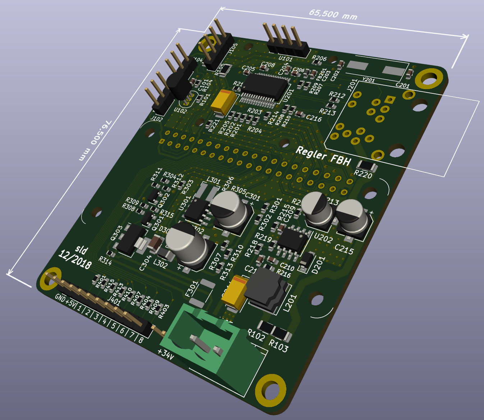

Heizungsteuerung

basierend auf Raspberry Pi Zero
- 10BaseT Ethernet (ENC28J60)
- Schmalspur PoE: 24V Eingang über die äusseren Päärchen
- Step-Down-Converter auf 5V
- MBus-Interface zum Auslesen von Wärmemengenzähler
- Anschluss für OneWire-Temperatursensor
- Anschluß für 8-Kanal-Relais-Karte
- Steckplat für 0,96" Oled-Display

